# Building Private AWS Infrastructure with Terraform
### 📌 Project Overview

This project demonstrates how to provision a secure private EC2 architecture on AWS using Terraform.  
Instead of manually creating the infrastructure through the AWS Management Console, Terraform is used to provision and manage the entire environment as code.

```
🏗️ Architecture
                         AWS VPC
                      10.0.0.0/16
                            │
             ┌──────────────┴──────────────┐
             │                             │
       Public Subnet                 Private Subnet
        10.0.1.0/24                  10.0.2.0/24
             │                             │
      Internet Gateway                Private EC2
                                           │
                                        IAM Role
                                           │
                                      HTTPS :443
                                           │
                          ┌────────────────┼────────────────┐
                          │                │                │
                         SSM          SSMMessages      EC2Messages
                      Endpoint          Endpoint          Endpoint
                          └────────────────┼────────────────┘
                                           │
                                    AWS Systems Manager
                                           │
                                    Session Manager

```
### 🎯 Project Objectives
- Provision AWS networking infrastructure using Terraform.
- Deploy an EC2 instance in a private subnet with no public IP.
- Configure IAM permissions for Systems Manager.
- Enable private Systems Manager connectivity using VPC Interface Endpoints.
- Validate the security architecture from both AWS Console and the EC2 environment.
- Demonstrate Terraform's `plan`, `apply`, change management, `destroy`, and recreation workflows.

### 🛠️ Technologies
- Terraform
- Amazon VPC
- Amazon EC2
- AWS IAM
- AWS Systems Manager
- VPC Interface Endpoints
- Session Manager

### 📈 Difficulty

⭐⭐⭐☆☆ — Intermediate

This project focuses on integrating Infrastructure as Code with cloud security architecture, rather than learning individual AWS services in isolation.  
The project also includes a troubleshooting scenario where the initial Systems Manager connectivity failed because the VPC DNS configuration required by the Interface Endpoints had not been explicitly enabled.

## Phase 1 — Design & Terraform Foundation

This phase is used to determine the Terraform system's structure and configuration prior to the creation of AWS infrastructure.

### 🎯 Objective
```
- Create the Terraform project's structure.
- Configure the AWS provider.
- Determine Terraform variables.
- Using terraform.tfvars, add a value.
- Inisialize Terraform.
```
### Step 1 — Create Project Structure

**Create a dedicated directory for the project :**
```
Private EC2 with Terraform/
├── main.tf
├── outputs.tf
├── provider.tf
├── terraform.tfvars
└── variables.tf
```
**File preparation and functionality:**

* ``provider.tf``	Terraform & AWS provider configuration
* ``variables.tf``	Mendefinisikan input variables
* ``terraform.tfvars``	Memberikan value untuk variables
* ``main.tf``	Mendefinisikan infrastructure resources
* ``outputs.tf``	Mendefinisikan output Terraform
---
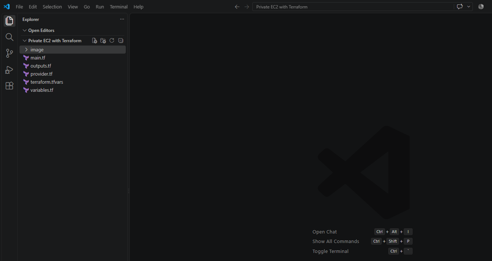
---

### Step 2 — Configure AWS Provider

**Inside provider.tf:**
```
terraform {
  required_providers {
    aws = {
      source  = "hashicorp/aws"
      version = "~> 6.0"
    }
  }

  required_version = ">= 1.6.0"
}

provider "aws" {
  region = var.aws_region
}
```
This configuration specifies the AWS provider that Terraform uses and links the AWS region to the variable aws_region.

---
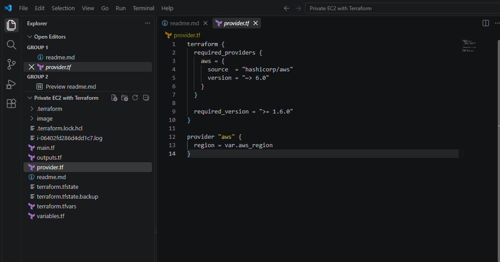
---

### Step 3 — Define AWS Region Variable

**Inside variables.tf:**
```
variable "aws_region" {
  description = "AWS region used for this project"
  type        = string
}
```
**And then inside terraform.tfvars:**
```
aws_region = "ap-southeast-1"
```

`variables.tf` defines variables, while `terraform.tfvars` provides their values.

---
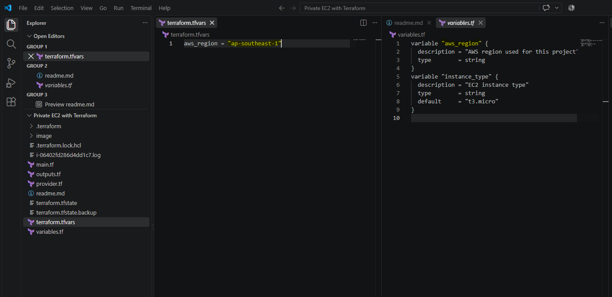
---

### Step 4 — Initialize Terraform

**Run:**

``terraform init``

Terraform successfully initialized the project and downloaded the AWS provider.

**Provider used:**

``hashicorp/aws v6.63.0``

---
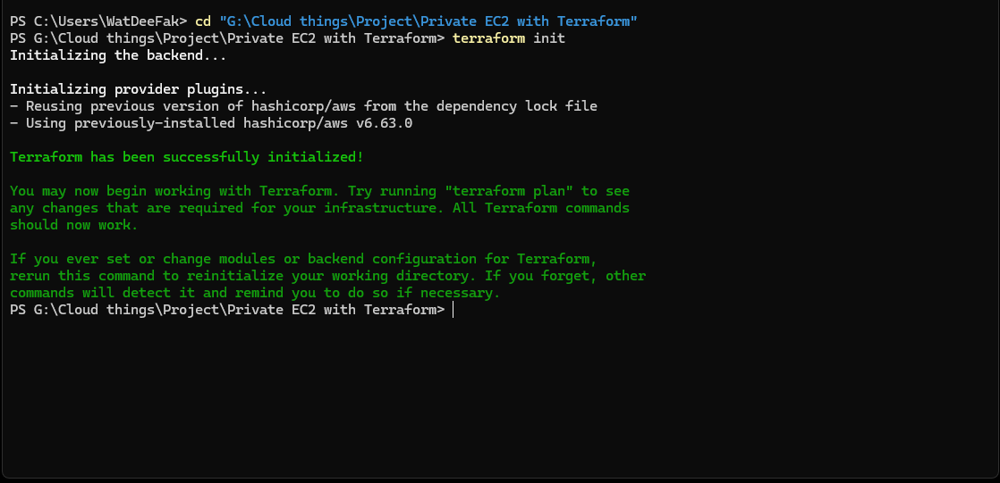
---

### Step 5 — Validate Terraform Configuration

**Run:**

``terraform validate``

**Result:**

> Success! The configuration is valid.

This validation ensures that Terraform configuration can be completed successfully.

---
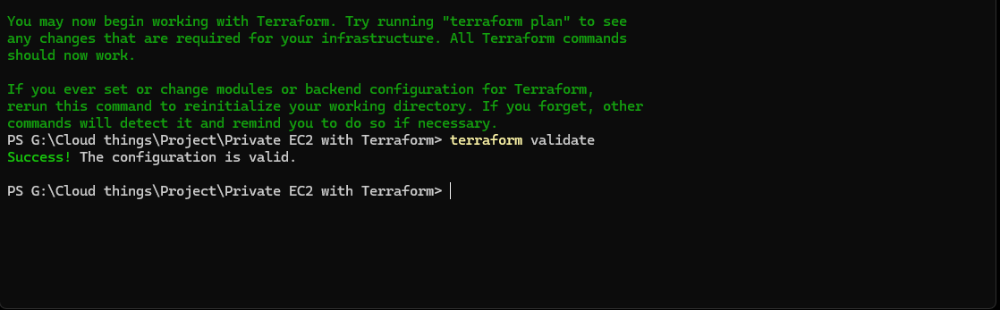

## 🧠 Key Concepts
### Terraform Configuration

Terraform uses several `.tf` files to form a single configuration.
```
provider.tf
variables.tf
main.tf
outputs.tf
       ↓
Terraform Configuration
```
### Variable vs Value
```
variables.tf
→ define variable

terraform.tfvars
→ define value
```

### Step 1 — Create the VPC

The project starts with a custom VPC using the 10.0.0.0/16 CIDR range.
```
resource "aws_vpc" "main" {
  cidr_block = "10.0.0.0/16"

  tags = {
    Name = "private-ec2-vpc"
  }
}
```
The VPC provides the overall network address space for the project.

**A VPC ID output was also defined in `outputs.tf`:**
```
output "vpc_id" {
  description = "ID of the VPC"
  value       = aws_vpc.main.id
}
```
**Validation**
```
terraform fmt
terraform validate
terraform plan
```
---
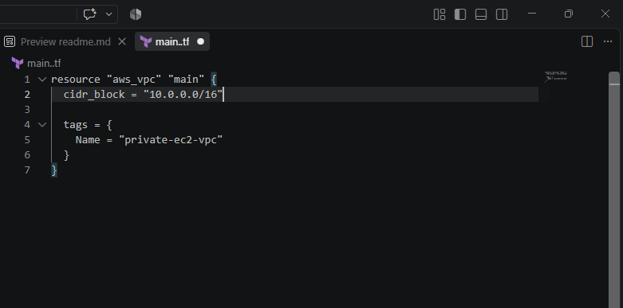
---

### Step 2 — Create Public and Private Subnets

Two subnets were created inside the VPC.

**Public Subnet**
```
resource "aws_subnet" "public" {
  vpc_id                  = aws_vpc.main.id
  cidr_block              = "10.0.1.0/24"
  availability_zone       = "ap-southeast-1a"
  map_public_ip_on_launch = true

  tags = {
    Name = "public-subnet"
  }
}
```
**Private Subnet**
```
resource "aws_subnet" "private" {
  vpc_id                  = aws_vpc.main.id
  cidr_block              = "10.0.2.0/24"
  availability_zone       = "ap-southeast-1a"
  map_public_ip_on_launch = false

  tags = {
    Name = "private-subnet"
  }
}
```
**The resulting network structure:**
```
VPC
10.0.0.0/16
│
├── Public Subnet
│   10.0.1.0/24
│
└── Private Subnet
    10.0.2.0/24
```
`map_public_ip_on_launch = false` was used for the private subnet so instances launched there would not automatically receive a public IPv4 address.

However, subnet classification is primarily determined by routing, which is configured in the following steps.

**Validation**
```
terraform fmt
terraform validate
terraform plan
```
**Expected plan at this stage:**
> Plan: 3 to add, 0 to change, 0 to destroy.
---
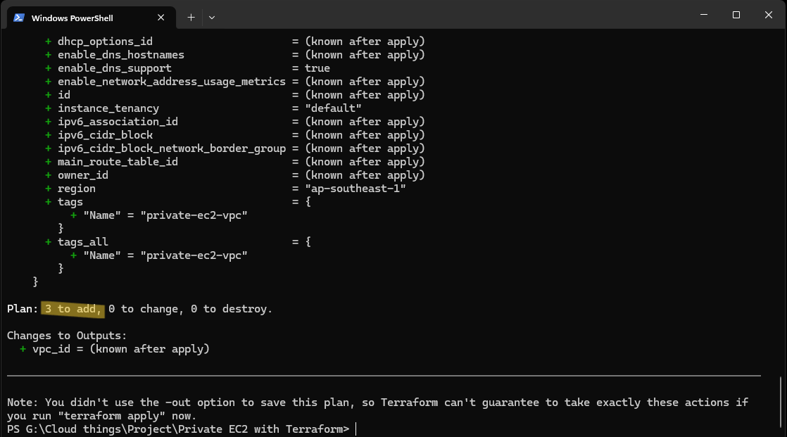
---
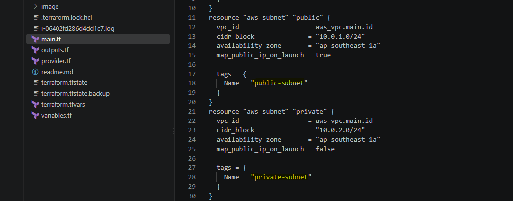
---
### Step 3 — Create an Internet Gateway

**An Internet Gateway was attached to the VPC:**
```
resource "aws_internet_gateway" "main" {
  vpc_id = aws_vpc.main.id

  tags = {
    Name = "private-ec2-igw"
  }
}
```
The Internet Gateway provides the VPC with a path to the internet when a subnet has an appropriate route.

At this stage, simply creating an Internet Gateway does not make a subnet public. The route table configuration determines whether the subnet can use it.

### Step 4 — Create Route Tables and Associations
**Public Route Table**  
The public route table was configured with a default route to the Internet Gateway:
```
resource "aws_route_table" "public" {
  vpc_id = aws_vpc.main.id

  route {
    cidr_block = "0.0.0.0/0"
    gateway_id = aws_internet_gateway.main.id
  }

  tags = {
    Name = "public-route-table"
  }
}
```
**The public subnet was then associated with the route table:**
```
resource "aws_route_table_association" "public" {
  subnet_id      = aws_subnet.public.id
  route_table_id = aws_route_table.public.id
}
```
**Result:**
```
Public Subnet
      ↓
Public Route Table
      ↓
0.0.0.0/0
      ↓
Internet Gateway
```
**Private Route Table**  
The private route table was created without a default route to the Internet Gateway:
```
resource "aws_route_table" "private" {
  vpc_id = aws_vpc.main.id

  tags = {
    Name = "private-route-table"
  }
}
```
**The private subnet was associated with it:**
```
resource "aws_route_table_association" "private" {
  subnet_id      = aws_subnet.private.id
  route_table_id = aws_route_table.private.id
}
```
**Result:**
```
Private Subnet
      ↓
Private Route Table
      ↓
10.0.0.0/16 → local
```
**There is no:**

> 0.0.0.0/0 → Internet Gateway  
and no NAT Gateway route.

This routing configuration is what establishes the private network path.

---
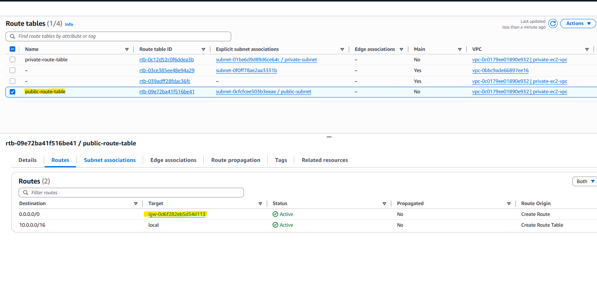
---
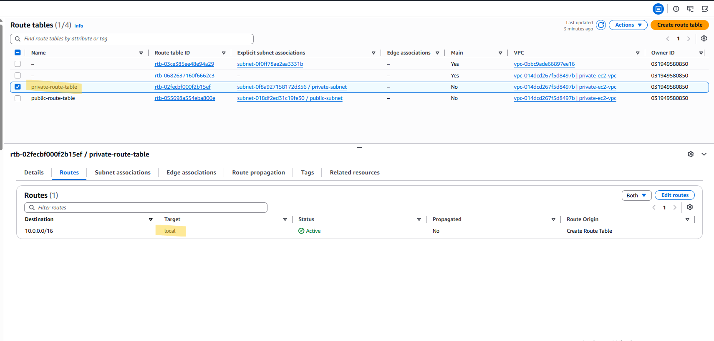
---
### Step 5 — Create the Private EC2 Security Group

The Security Group for the future private EC2 instance was created without inbound rules:
```
resource "aws_security_group" "private_ec2" {
  name        = "private-ec2-sg"
  description = "Security group for private EC2"
  vpc_id      = aws_vpc.main.id

  egress {
    description = "Allow outbound traffic"
    from_port   = 0
    to_port     = 0
    protocol    = "-1"
    cidr_blocks = ["0.0.0.0/0"]
  }

  tags = {
    Name = "private-ec2-sg"
  }
}
```
**No inbound rule was created for:**
```
TCP 22
TCP 80
TCP 443
```
This prepares the security group for the later Private EC2 deployment, where administrative access will be provided through Systems Manager instead of SSH.

---
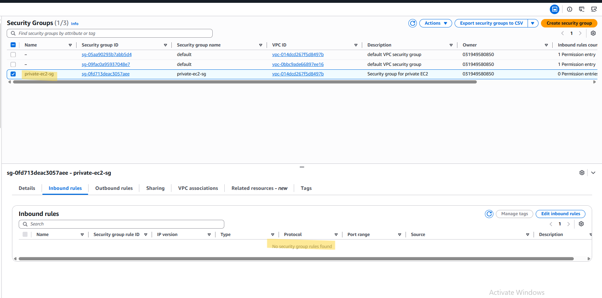
---

### Step 6 — Validate the Terraform Plan

After all networking resources were defined:
```
terraform fmt
terraform validate
terraform plan
```
**The final plan showed:**  
> Plan: 9 to add, 0 to change, 0 to destroy.

**The nine resources consisted of:**
```
1 VPC
2 Subnets
1 Internet Gateway
2 Route Tables
2 Route Table Associations
1 Security Group
```
---

---
### Step 7 — Deploy the VPC Architecture

**The infrastructure was deployed with:**

`terraform apply`

**After reviewing the plan:**

`yes`

Terraform completed successfully:
```
Apply complete!
Resources: 9 added, 0 changed, 0 destroyed.
```
---
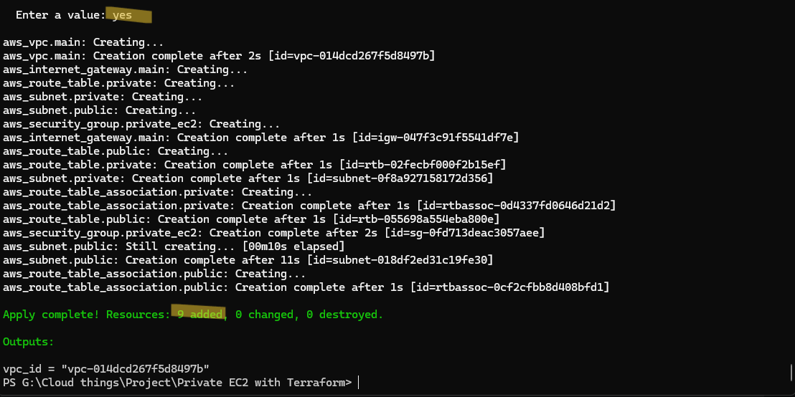
---
### Step 8 — Validate the Architecture in AWS

The deployed environment was then verified from the AWS Console.

**The Resource Map confirmed:**
```
VPC
├── Public Subnet
└── Private Subnet
```
**Public Route Table**  
Confirmed:
```
10.0.0.0/16 → local
0.0.0.0/0   → Internet Gateway
```
**Private Route Table**  
Confirmed:
```
10.0.0.0/16 → local
```
with no default route to an Internet Gateway or NAT Gateway.

---
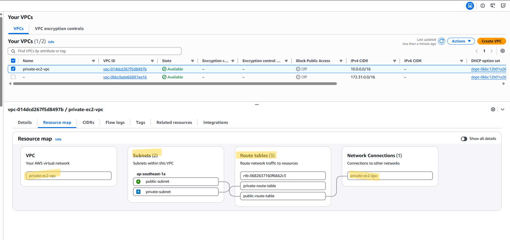
---

## 🧠 Key Concepts Learned
### Public vs. Private Subnet

A subnet is not considered public simply because it is named "public."  
The routing determines the network path:
```
Public:
Subnet
  ↓
Route Table
  ↓
Internet Gateway
```
```
Private:
Subnet
  ↓
Route Table
  ↓
No direct Internet Gateway route
```

## Phase 3 — Deploy Private EC2
### 🎯 Objective

In this phase, the private EC2 workload is deployed into the VPC architecture created in Phase 2.

The EC2 instance is designed with a security-first configuration:
```
- Deploy into the private subnet.
- No public IPv4 address.
- Use an IAM role for Systems Manager.
- Use a dedicated Security Group without inbound SSH.
- Use Amazon Linux 2023.
```
### Step 1 — Define the EC2 Instance Type Variable

Add the instance type variable to `variables.tf:`
```
variable "instance_type" {
  description = "EC2 instance type"
  type        = string
  default     = "t3.micro"
}
```
The default value keeps the project configuration simple while still allowing the instance type to be overridden when needed.

---
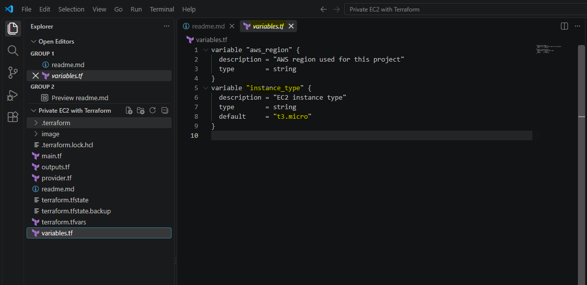
---
### Step 2 — Retrieve the Latest Amazon Linux 2023 AMI

Instead of hardcoding an AMI ID, the project uses AWS Systems Manager Parameter Store to retrieve the latest Amazon Linux 2023 AMI.

In `main.tf:`
```
data "aws_ssm_parameter" "al2023_ami" {
  name = "/aws/service/ami-amazon-linux-latest/al2023-ami-kernel-default-x86_64"
}
```
The AMI value is then referenced dynamically by the EC2 resource.  
This avoids hardcoding a region-specific AMI ID.


### Step 3 — Create the IAM Role

The EC2 instance requires an IAM role to communicate with AWS Systems Manager.

**Add:**
```
resource "aws_iam_role" "ec2_ssm" {
  name = "private-ec2-ssm-role"

  assume_role_policy = jsonencode({
    Version = "2012-10-17"

    Statement = [
      {
        Effect = "Allow"

        Principal = {
          Service = "ec2.amazonaws.com"
        }

        Action = "sts:AssumeRole"
      }
    ]
  })
}
```
The trust policy allows the EC2 service to assume this role.

**Architecture:**
```
EC2
 ↓
Assume Role
 ↓
private-ec2-ssm-role
```
---
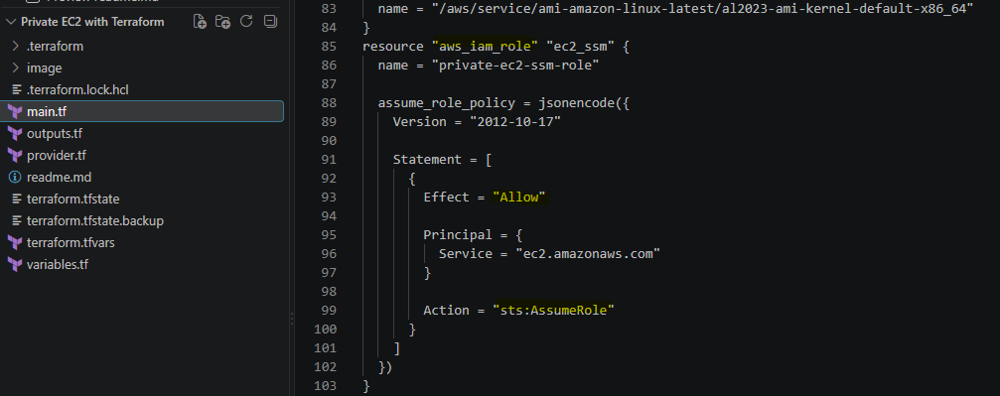
---
### Step 4 — Attach the Systems Manager Policy

**Attach the AWS managed policy required for Systems Manager:**
```
resource "aws_iam_role_policy_attachment" "ec2_ssm" {
  role       = aws_iam_role.ec2_ssm.name
  policy_arn = "arn:aws:iam::aws:policy/AmazonSSMManagedInstanceCore"
}
```
This gives the EC2 instance the permissions required for Systems Manager operations.

**The project deliberately avoids broad permissions such as:**
```
AdministratorAccess
AmazonEC2FullAccess
PowerUserAccess
```

### Step 5 — Create the IAM Instance Profile

**EC2 uses an Instance Profile to receive the IAM role.**
```
resource "aws_iam_instance_profile" "ec2_ssm" {
  name = "private-ec2-ssm-profile"
  role = aws_iam_role.ec2_ssm.name
}
```
**The relationship is:**
```
IAM Role
   ↓
Instance Profile
   ↓
EC2
```
This distinction is important because EC2 does not directly attach an IAM role. The role is associated through an instance profile.

### Step 6 — Validate the IAM Resources

**Run:**
```
- terraform fmt
- terraform validate
- terraform plan
```
**The expected plan is:**

Plan: 3 to add, 0 to change, 0 to destroy.

**The three resources are:**
```
1. IAM Role
2. IAM Policy Attachment
3. IAM Instance Profile
```
---
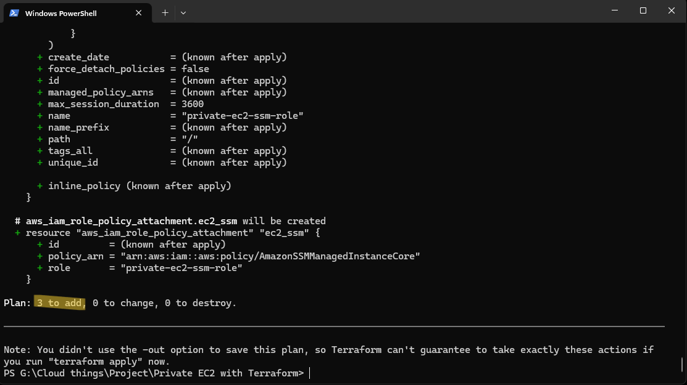
---
### Step 7 — Create the Private EC2 Instance

**Now the EC2 resource can use everything prepared in the previous steps:**
```
resource "aws_instance" "private_ec2" {
  ami           = data.aws_ssm_parameter.al2023_ami.value
  instance_type = var.instance_type

  subnet_id                   = aws_subnet.private.id
  vpc_security_group_ids     = [aws_security_group.private_ec2.id]
  associate_public_ip_address = false

  iam_instance_profile = aws_iam_instance_profile.ec2_ssm.name

  tags = {
    Name = "private-ec2"
  }
}
```
The important security settings are:
`subnet_id = aws_subnet.private.id`  
and:
`associate_public_ip_address = false`

This ensures the instance is deployed into the private subnet without automatically receiving a public IPv4 address.

The Security Group from Phase 2 is also reused:  
`vpc_security_group_ids = [aws_security_group.private_ec2.id]`

### Resource dependency  

Terraform can automatically determine the relationship:
```
VPC
 ↓
Private Subnet
 ↓
EC2
```
**and:**
```
IAM Role
 ↓
Instance Profile
 ↓
EC2
```
Terraform therefore determines the appropriate creation order automatically.

### Step 8 — Validate the EC2 Plan

**Run:**
```
- terraform fmt
- terraform validate
- terraform plan
```
**The plan should now show:**

Plan: 4 to add, 0 to change, 0 to destroy.

**The four resources are:**
```
3 IAM resources
+
1 EC2 instance
```
**The EC2 plan should show values such as:**
```
AMI            → Amazon Linux 2023
Instance type  → t3.micro
Subnet         → private-subnet
Public IP      → false
IAM profile    → private-ec2-ssm-profile
```

### Step 9 — Deploy the EC2

**After reviewing the plan:**

`terraform apply`

**Confirm with:**

`yes`

**Terraform should complete with:**
```
Apply complete!
Resources: 4 added, 0 changed, 0 destroyed.
```
---
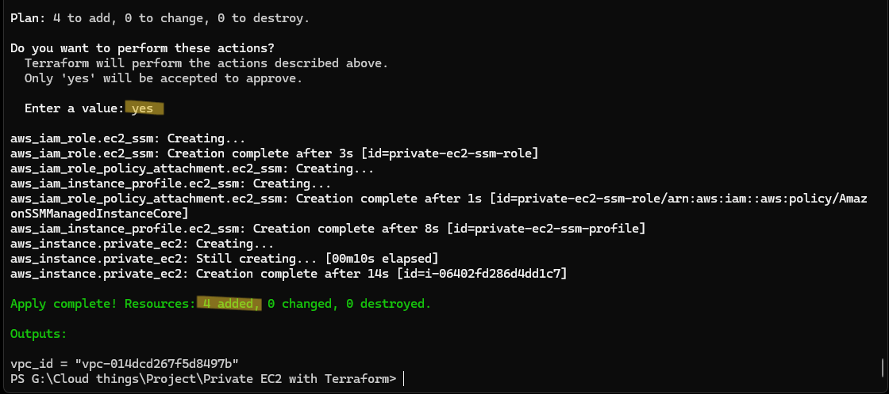
---
### Step 10 — Validate the EC2 in AWS

**Open:**

`EC2 → Instances → private-ec2`

**Validate:**
```
Instance state       → Running
Instance type        → t3.micro
Private IPv4         → 10.0.2.x
Public IPv4 address  → -
Public DNS           → -
Subnet               → private-subnet
VPC                  → private-ec2-vpc
IAM role             → private-ec2-ssm-role
```
**The expected architecture is:**
```
Private Subnet
10.0.2.0/24
      │
      └── Private EC2
           │
           ├── Private IP ✅
           ├── Public IP ❌
           ├── SSH ❌
           └── IAM Role ✅
```
At this stage the instance does not yet need to appear as a Systems Manager Managed Node. Systems Manager connectivity is configured in Phase 4.

---
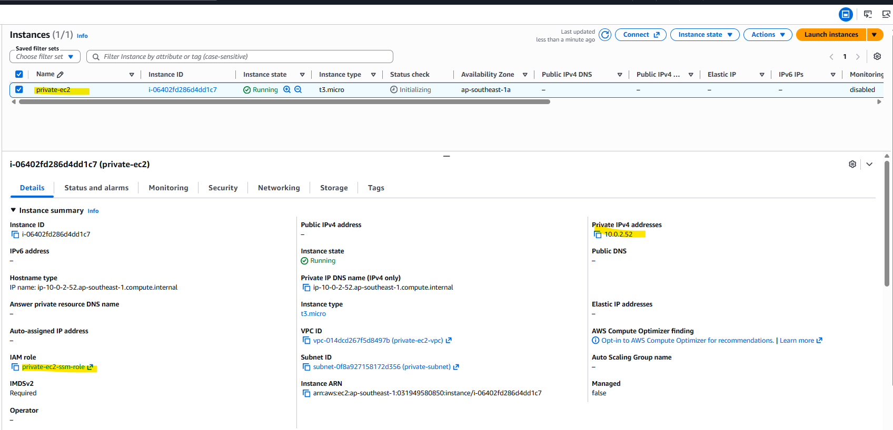
---

## 🧠 Key Concepts Learned
### AMI Data Source vs Resource

The AMI is retrieved using a Terraform `data source:`

``data "aws_ssm_parameter" "al2023_ami"``

while the EC2 itself is a Terraform `resource:`

``resource "aws_instance" "private_ec2"``

**Conceptually:**
```
Data Source
→ Retrieve existing information

Resource
→ Create/manage infrastructure
```
### IAM Role vs Instance Profile
```
IAM Role
   ↓
Instance Profile
   ↓
EC2
```
The role defines the permissions, while the instance profile is what EC2 uses to receive that role.

### Security-by-Default EC2

**The EC2 was created with:**
```
Private subnet
+
No Public IP
+
No SSH inbound
+
IAM role
```
Systems Manager access is intentionally handled separately in Phase 4.

## Phase 4 — Enable Systems Manager Connectivity
### 🎯 Objective

This phase enables secure Systems Manager connectivity for the private EC2 instance without requiring:

* A public IPv4 address.
* SSH access.
* A NAT Gateway.
* Direct internet connectivity.

The EC2 instance communicates with Systems Manager through private VPC Interface Endpoints.

###  Step 1 — Create the VPC Endpoint Security Group

A dedicated Security Group was created for the Systems Manager Interface Endpoints.
```
resource "aws_security_group" "ssm_endpoints" {
  name        = "ssm-endpoints-sg"
  description = "Security group for Systems Manager VPC endpoints"
  vpc_id      = aws_vpc.main.id

  ingress {
    description     = "HTTPS from private EC2 subnet"
    from_port       = 443
    to_port         = 443
    protocol        = "tcp"
    cidr_blocks     = [aws_subnet.private.cidr_block]
  }

  egress {
    description = "Allow outbound traffic"
    from_port   = 0
    to_port     = 0
    protocol    = "-1"
    cidr_blocks = ["0.0.0.0/0"]
  }

  tags = {
    Name = "ssm-endpoints-sg"
  }
}
```
**Only HTTPS traffic from the private subnet is allowed to reach the endpoints:**
```
Private EC2
    │
    │ TCP 443
    ↓
SSM Endpoint Security Group
```
---
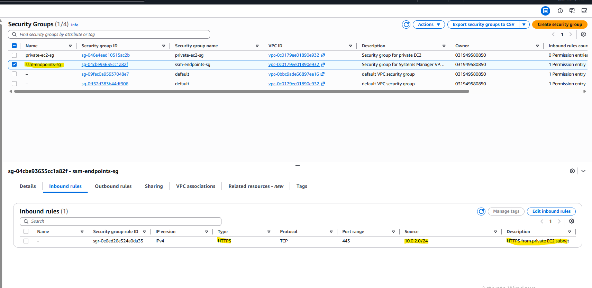
---
### Step 2 — Create the SSM Interface Endpoint
Inside `main.tf :`
```
resource "aws_vpc_endpoint" "ssm" {
  vpc_id              = aws_vpc.main.id
  service_name        = "com.amazonaws.${var.aws_region}.ssm"
  vpc_endpoint_type   = "Interface"
  subnet_ids          = [aws_subnet.private.id]
  security_group_ids  = [aws_security_group.ssm_endpoints.id]
  private_dns_enabled = true

  tags = {
    Name = "ssm-endpoint"
  }
}
```
This creates private connectivity between the EC2 instance and the Systems Manager service.

### Step 3 — Create the SSMMessages Interface Endpoint
Inside `main.tf :`
```
resource "aws_vpc_endpoint" "ssmmessages" {
  vpc_id              = aws_vpc.main.id
  service_name        = "com.amazonaws.${var.aws_region}.ssmmessages"
  vpc_endpoint_type   = "Interface"
  subnet_ids          = [aws_subnet.private.id]
  security_group_ids  = [aws_security_group.ssm_endpoints.id]
  private_dns_enabled = true

  tags = {
    Name = "ssmmessages-endpoint"
  }
}
```
This endpoint supports Systems Manager messaging and Session Manager communication.

### Step 4 — Create the EC2Messages Interface Endpoint
Inside `main.tf :`
```
resource "aws_vpc_endpoint" "ec2messages" {
  vpc_id              = aws_vpc.main.id
  service_name        = "com.amazonaws.${var.aws_region}.ec2messages"
  vpc_endpoint_type   = "Interface"
  subnet_ids          = [aws_subnet.private.id]
  security_group_ids  = [aws_security_group.ssm_endpoints.id]
  private_dns_enabled = true

  tags = {
    Name = "ec2messages-endpoint"
  }
}
```
**The project therefore uses three Systems Manager-related Interface Endpoints:**
```
ssm
ssmmessages
ec2messages
```
---
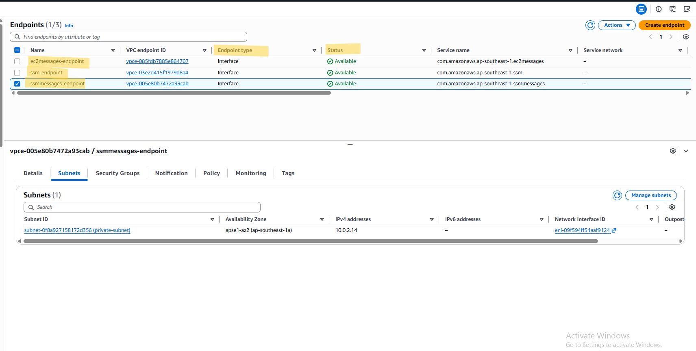
---

### Step 5 — Validate Terraform Configuration

**Run:**
```
terraform fmt
terraform validate
terraform plan
terraform apply
```
**The initial plan showed:**

> Plan: 4 to add, 0 to change, 0 to destroy.

**The four resources were:**
```
1 × Endpoint Security Group
3 × Interface VPC Endpoints
```

### Step 6 — Troubleshoot VPC DNS Configuration

The first terraform apply failed when creating the Interface Endpoints with private DNS enabled.  
The error indicated that both VPC DNS attributes were required.

**The VPC configuration was updated:**
```
resource "aws_vpc" "main" {
  cidr_block = "10.0.0.0/16"

  enable_dns_support   = true
  enable_dns_hostnames = true

  tags = {
    Name = "private-ec2-vpc"
  }
}
```
**Terraform then showed:**

> Plan: 3 to add, 1 to change, 0 to destroy.

The VPC was updated and the three endpoints were successfully created.

---
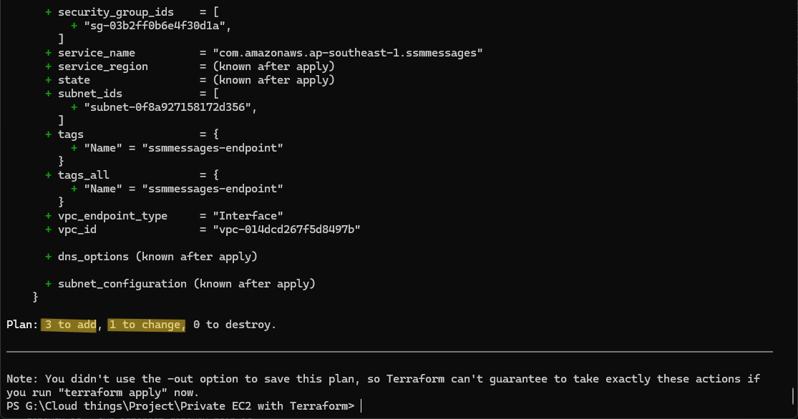
---
### Step 7 — Apply the VPC Endpoints

**Run:**

`terraform apply`

**The deployment completed successfully:**
```
Apply complete!
Resources: 3 added, 1 changed, 0 destroyed.
```
---
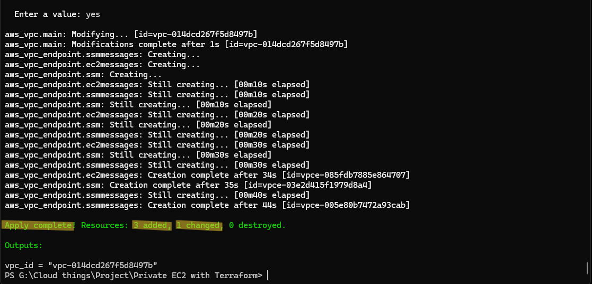
---
### Step 8 — Validate the Systems Manager Managed Node

After the endpoints became available, the EC2 instance eventually appeared in Systems Manager:
```
Managed nodes (1)
private-ec2
Ping status: Online
```
A Session Manager connection was then successfully established.

The EC2 remained:

Public IP → None

This confirmed that Systems Manager access did not require exposing the instance to the public internet.

---
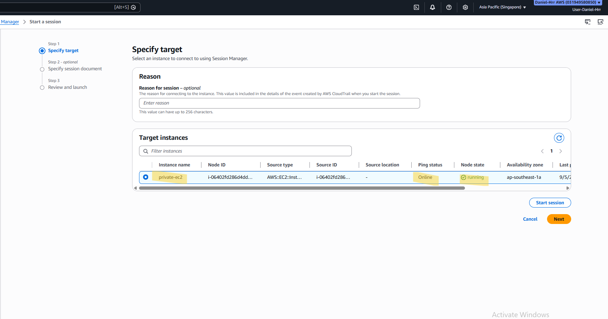
-----
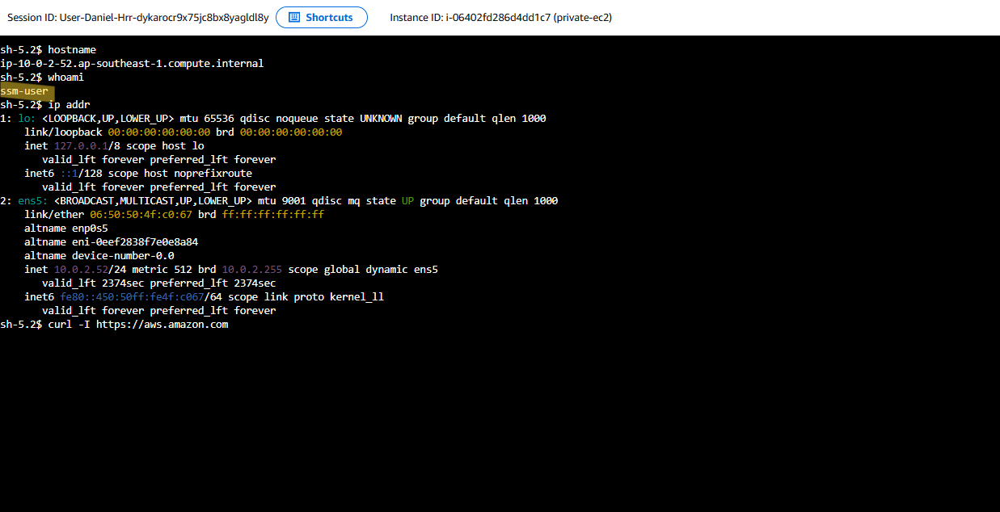
---
### Step 9 — Validate Private DNS Resolution

**From inside the Session Manager shell:**

`nslookup ssm.ap-southeast-1.amazonaws.com`

**The result showed the VPC DNS resolver:**

`Server: 10.0.0.2`

**and resolved the Systems Manager hostname to a private endpoint address:**  

`ssm.ap-southeast-1.amazonaws.com → 10.0.2.129`

This confirmed that private DNS was resolving the Systems Manager hostname to the Interface Endpoint rather than the public service address.

---
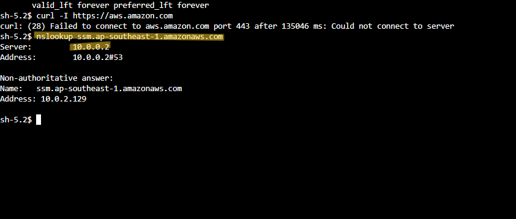
---
### Step 10 — Validate Terraform State

**Finally:**

`terraform plan`

**Result:**
```
No changes.
Your infrastructure matches the configuration.
```
This confirmed that the recreated AWS environment still matched the Terraform configuration.

### 🔧 Troubleshooting
> Issue: Interface Endpoint Creation Failed

**Symptom:**  
Interface endpoints could not be created with private DNS enabled.

**Root Cause:**  
The VPC did not have both DNS attributes explicitly enabled:
```
enableDnsSupport
enableDnsHostnames
```
**Resolution:**  
The VPC was updated through Terraform:
```
enable_dns_support   = true
enable_dns_hostnames = true
```
The endpoints were then successfully created.

### Additional Observation

After endpoint deployment, the Systems Manager Managed Node registration was not immediate. It took me 20 minutes wait for the node to be appears. The instance eventually registered without further infrastructure changes.

The initial boot log also showed an SSM Agent connection timeout while attempting to reach the Systems Manager service. The instance later registered successfully after private endpoint connectivity became available.

## 🧠 Key Concepts Learned
### Private Systems Manager Connectivity
```
Private EC2
     │
     │ HTTPS 443
     ↓
VPC Interface Endpoints
     ↓
AWS Systems Manager
     ↓
Session Manager
```
### No Public Access Required
```
Private EC2
├── No Public IP
├── No SSH
└── No NAT Gateway
       ↓
Private Systems Manager connectivity
```

### With private DNS enabled:
```
ssm.ap-southeast-1.amazonaws.com
              ↓
        VPC DNS Resolver
              ↓
     Private Endpoint IP
```
This allows the EC2 instance to use the standard AWS service hostname while traffic is directed through the private VPC endpoint.

## Phase 5 — Security Validation
### 🎯 Objective

This phase validates whether the infrastructure deployed with Terraform actually meets the intended security requirements.

**The validation focuses on:**
```
- EC2 network exposure.
- Security Group configuration.
- Private subnet routing.
- VPC Endpoint security.
- IAM permissions.
- Systems Manager access.
- Private DNS resolution.
- Terraform state consistency.
```
The goal is to validate security behavior, not just confirm that Terraform deployment succeeded.


### Step 1 — Validate EC2 Exposure

The EC2 instance was reviewed to confirm that it remained private.

**Expected configuration:**
```
Instance State       → Running
Private IPv4         → 10.0.2.x
Public IPv4          → None
Public DNS           → None
Subnet               → private-subnet
VPC                  → private-ec2-vpc
```
The instance therefore has no public IPv4 address and is deployed inside the private subnet.

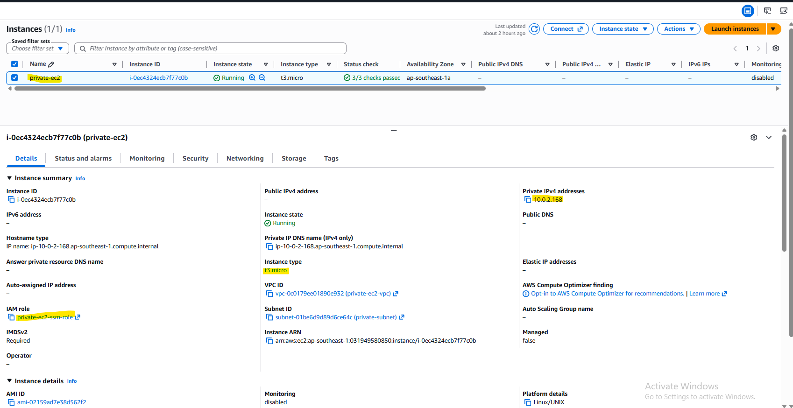
---
### Step 2 — Validate the EC2 Security Group

The private-ec2-sg Security Group was reviewed.

**Inbound rules:**

> Inbound Rules → 0

**No inbound SSH rule was configured.**
```
TCP 22 → Not allowed
TCP 80 → Not allowed
TCP 443 → Not allowed
```
The instance therefore does not expose an inbound administrative port.


---
### Step 3 — Validate Private Routing

The private route table was inspected to verify that the subnet has no direct internet path.

**Expected routes:**
```
Destination      Target
10.0.0.0/16      local
```
**There is no:**
```
0.0.0.0/0 → Internet Gateway
0.0.0.0/0 → NAT Gateway
```
This confirms that the private subnet does not have a default route to the internet.


---
### Step 4 — Validate VPC Endpoint Security

**The three Systems Manager Interface Endpoints were validated:**
```
ssm
ssmmessages
ec2messages
```
**Expected configuration:**
```
Endpoint Type        → Interface
Status               → Available
Private DNS          → Enabled
Subnet               → private-subnet
```
**The endpoint Security Group allows:**
```
TCP 443
Source: 10.0.2.0/24
```
This allows the private EC2 subnet to communicate with the Systems Manager endpoints over HTTPS.

### Step 5 — Validate IAM Permissions

**The EC2 IAM role was reviewed:**

`private-ec2-ssm-role`

**The attached permission policy was:**

`AmazonSSMManagedInstanceCore`

The role is provided to EC2 through the Instance Profile.

**Architecture:**
```
EC2
 ↓
Instance Profile
 ↓
IAM Role
 ↓
AmazonSSMManagedInstanceCore
```
No broad administrative policies were added.

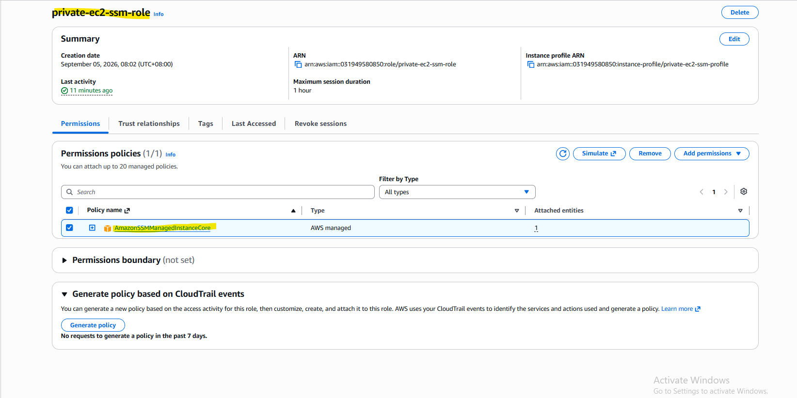
---
### Step 6 — Perform End-to-End Session Manager Validation

The EC2 instance was successfully registered as a Systems Manager Managed Node.

**Expected:**
```
Managed nodes (1)
private-ec2
Ping Status → Online
```
A Session Manager session was then started successfully.

**This demonstrated:**
```
AWS Console
      ↓
Systems Manager
      ↓
Session Manager
      ↓
Private EC2
```
**The connection worked without:**
> Public IP & SSH
### Step 7 — Validate Internet Isolation

A general internet request was tested from the private EC2:

`curl -I https://aws.amazon.com`

The request **did not succeed** because the private subnet has no default route to an Internet Gateway or NAT Gateway.

**This behavior is consistent with the intended architecture:**
```
Private EC2
     │
     ├── Systems Manager → ✅
     │      via VPC Endpoint
     │
     └── General Internet → ❌
```
This demonstrates that Systems Manager access does not require general outbound internet connectivity.

## 🔐 Security Validation Summary

The final architecture was validated against the intended security requirements:
```
Private EC2
├── No Public IP              ✅
├── No SSH                    ✅
├── Private Subnet            ✅
├── Private Routing           ✅
├── IAM Role                  ✅
├── SSM Endpoints             ✅
├── Private DNS               ✅
├── Managed Node              ✅
├── Session Manager           ✅
└── General Internet Access   ❌
```
The result demonstrates that the EC2 instance can be securely administered through Systems Manager while remaining isolated from direct public access.

## Phase 6 — Terraform Change & Redeployment
### 🎯 Objective

This phase demonstrates how Terraform manages controlled infrastructure changes after the initial deployment.

**The goal was to practice:**
```
- Establishing a Terraform baseline.
- Modifying infrastructure through code.
- Reviewing changes with terraform plan.
- Applying an in-place update.
- Validating the change in AWS.
- Confirming Terraform state consistency.
```
### Step 1 — Modify the EC2 Configuration

**The EC2 resource originally contained:**
```
tags = {
  Name = "private-ec2"
}
```
**An additional environment tag was added:**
```
tags = {
  Name        = "private-ec2"
  Environment = "Lab"
}
```
This was intentionally chosen as a safe infrastructure change that would not alter the security architecture.

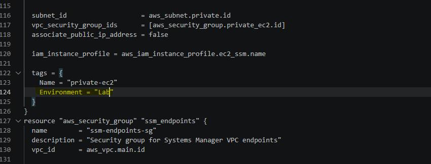
---
### Step 2 — Review the Terraform Plan

**After modifying the configuration:**
```
terraform fmt
terraform validate
terraform plan
```
**Terraform detected an in-place update:**

`~ aws_instance.private_ec2`

**The plan showed:**

> Plan: 0 to add, 1 to change, 0 to destroy.

Terraform explicitly indicated that the existing EC2 instance would be updated in-place rather than replaced.

This was important because no new instance would be created and the existing instance would not be destroyed.

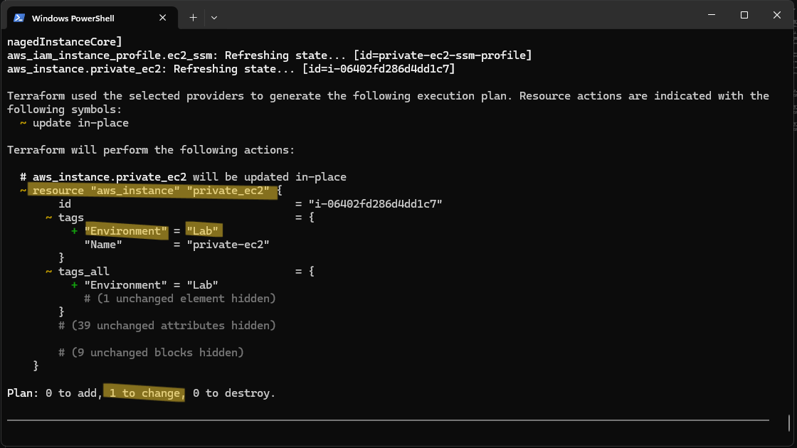
---
### Step 3 — Apply the Infrastructure Change

**The reviewed change was applied:**

`terraform apply`

**After confirmation:**

`yes`

**Terraform completed successfully:**
```
Apply complete!
Resources: 0 added, 1 changed, 0 destroyed.
```
This demonstrated that the change was applied without replacing the EC2 instance.

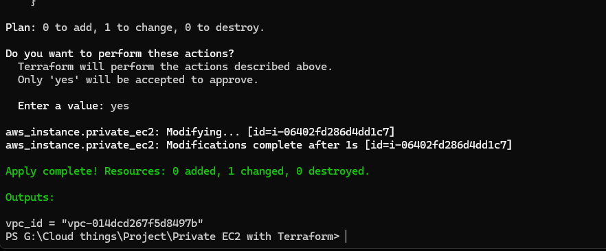
---

### Step 4 — Validate the Change in AWS

The EC2 instance was checked in the AWS Console.  
The existing instance remained the same, with the additional tag:
```
Name        → private-ec2
Environment → Lab
```
The same EC2 instance ID remained in use, confirming that the change was performed in-place.

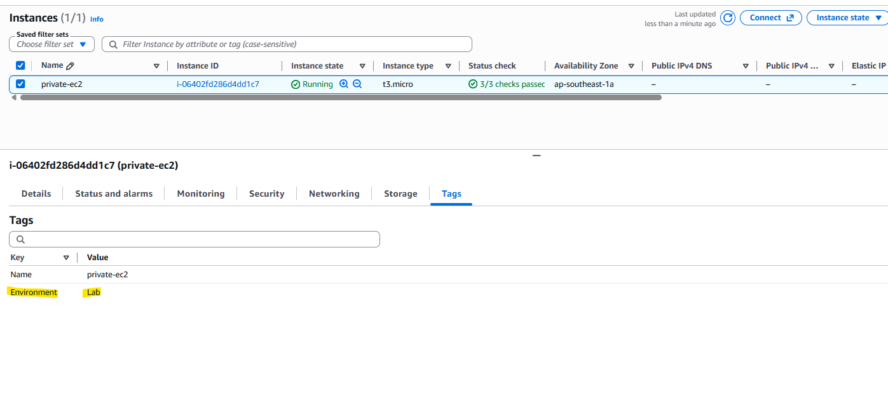
---
### 🧠 Key Concepts Learned
### In-Place Update

Terraform can modify an existing resource without destroying and recreating it.  
**In this case:**
```
0 to add
1 to change
0 to destroy
```
The EC2 instance remained intact.

### Infrastructure as Code

**Instead of manually modifying the EC2 tag in the AWS Console:**
```
AWS Console
→ Edit Tag
```
**the change was made in Terraform:**
```
Environment = "Lab"
```
The AWS infrastructure was then updated from the code.

## Phase 7 — Destroy & Recreate
### 🎯 Objective

This final phase demonstrates Terraform’s ability to fully remove and recreate the infrastructure from the same configuration.

**The goal was to validate:**
```
- Terraform-managed resource lifecycle.
- Dependency-aware resource destruction.
- Infrastructure reproducibility.
- Complete environment recreation from code.
- Final state consistency after redeployment.
```
### Step 1 — Establish the Final Baseline

Before destroying the environment, the Terraform configuration was verified:

`terraform plan`

**Result:**
```
No changes.
Your infrastructure matches the configuration.
```
**The Terraform state was also reviewed:**

`terraform state list`

This confirmed that the environment was fully managed by Terraform.

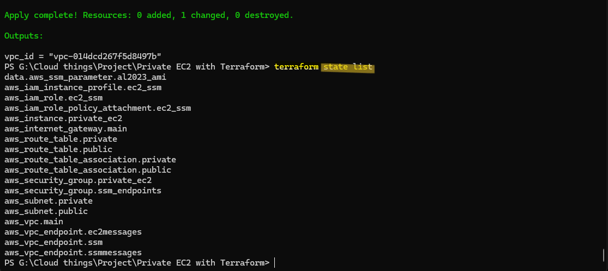
---
### Step 2 — Destroy the Infrastructure

**The complete environment was removed using:**

`terraform destroy`

**After reviewing the destructive plan, the operation was confirmed with:**

`yes`

**Terraform successfully removed the environment:**
```
Destroy complete!
Resources: 17 destroyed.
```
Terraform automatically handled resource dependencies during destruction, removing dependent resources before the resources they depended on.

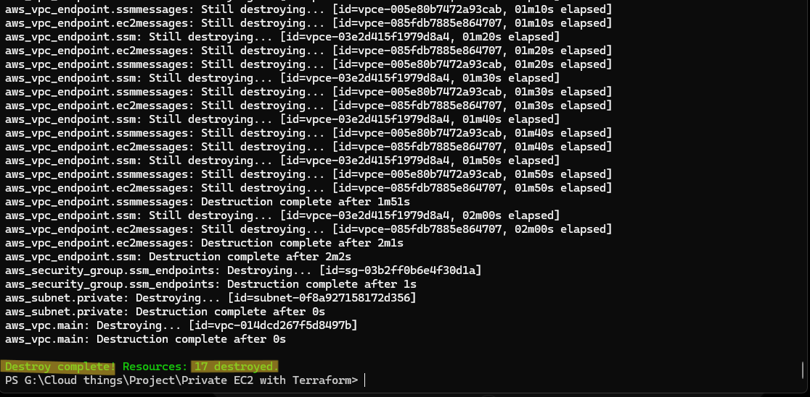
---
### Step 3 — Verify AWS Cleanup

The AWS Console was checked after the destroy operation.

**The previously deployed environment was no longer present:**
```
EC2
→ private-ec2
→ Removed

VPC
→ private-ec2-vpc
→ Removed

VPC Endpoints
→ Removed
```
This confirmed that the infrastructure had actually been deleted from AWS rather than only removed from Terraform state.

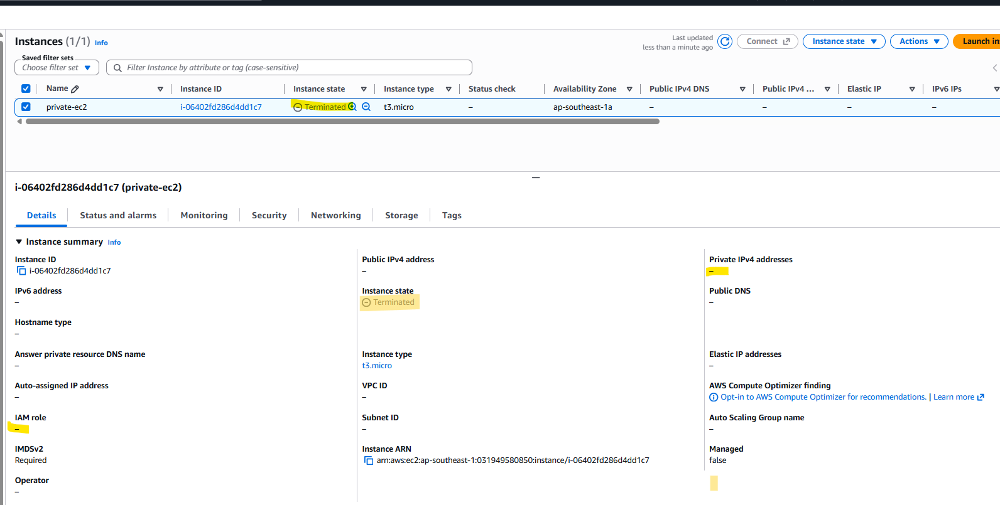
---
### Step 4 — Verify Terraform Reconciliation

**With AWS infrastructure removed but the Terraform configuration still intact:**

`terraform state list`

The previous managed resources were no longer present.

**Then:**

`terraform plan`

Terraform detected that the desired infrastructure was missing:

> Plan: 17 to add, 0 to change, 0 to destroy.

This demonstrated that Terraform could determine the infrastructure required solely from the configuration.

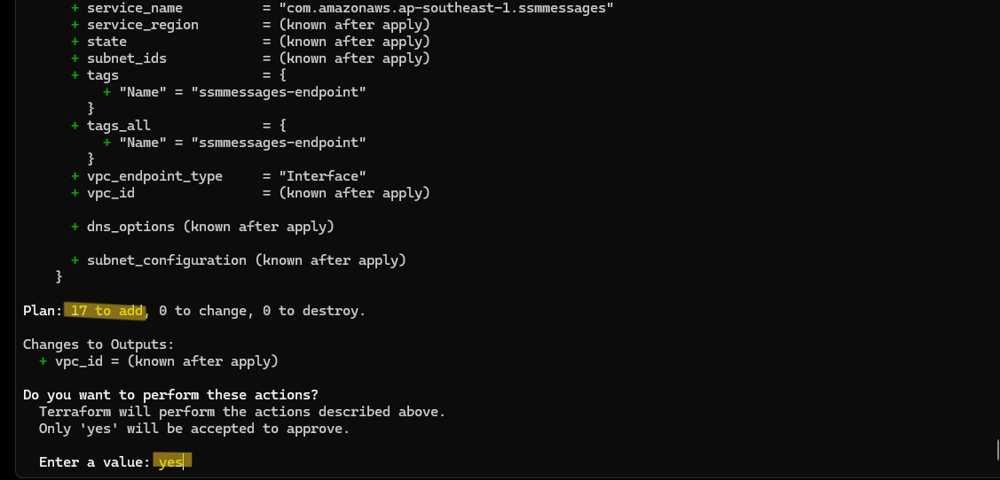
---
### Step 5 — Recreate the Infrastructure

**The complete environment was recreated using:**

`terraform apply`

**After reviewing the plan:**

`yes`

**Terraform successfully recreated all 17 resources:**
```
Apply complete!
Resources: 17 added, 0 changed, 0 destroyed.
```
No manual infrastructure configuration was required.

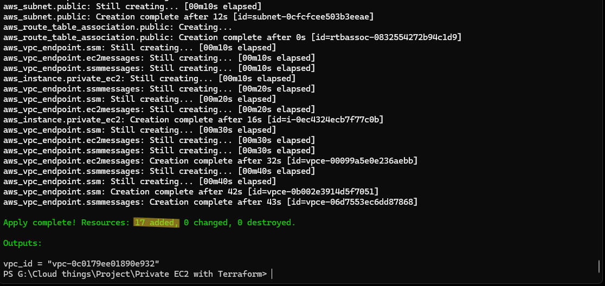
---
### Step 6 — Validate the Recreated EC2

The recreated EC2 instance was checked in AWS.

**The expected configuration was restored:**
```
Instance State       → Running
Private IPv4         → 10.0.2.x
Public IPv4          → None
Subnet               → private-subnet
IAM Role             → private-ec2-ssm-role
Environment          → Lab
```
This confirmed that the EC2 security configuration was reproduced from Terraform.

### Step 7 — Validate Systems Manager Again

After the recreated EC2 completed its SSM registration, it appeared again as a Managed Node:
```
private-ec2
Ping Status → Online
```
A Session Manager session was then successfully established.  
This demonstrated that the complete Systems Manager architecture was also reproducible:
```
Terraform
    ↓
Private EC2
    ↓
IAM Role
    ↓
VPC Endpoints
    ↓
Systems Manager
    ↓
Session Manager
```

---

## 🧠 Key Concepts Learned
### Infrastructure Reproducibility

The environment could be completely removed and recreated using the same Terraform configuration.
```
Same Code
   ↓
Same Architecture
```
### Dependency-Aware Destruction

Terraform determines resource dependencies and removes dependent resources before their dependencies.

**For example:**
```
EC2
 ↓
Private Subnet
 ↓
VPC
```
**During destruction:**
```
EC2
 ↓
Private Subnet
 ↓
VPC
```
This prevents Terraform from attempting to remove foundational resources while dependent resources still exist.

## Project Conclusion — Building Private AWS Infrastructure with Terraform
### 📌 Project Summary

This project demonstrated how to provision, secure, validate, modify, destroy, and recreate a private AWS EC2 architecture using Terraform.

**The environment was designed around a simple security requirement:**

> No public IP. No SSH. Secure administrative access through AWS Systems Manager Session Manager.

Terraform was used as the primary method for infrastructure provisioning and lifecycle management.
```
🏗️ Final Architecture
                         AWS VPC
                      10.0.0.0/16
                            │
             ┌──────────────┴──────────────┐
             │                             │
       Public Subnet                 Private Subnet
        10.0.1.0/24                  10.0.2.0/24
             │                             │
      Internet Gateway              Private EC2
                                           │
                                      IAM Role
                                           │
                                      HTTPS :443
                                           │
                          ┌────────────────┼────────────────┐
                          │                │                │
                         SSM          SSMMessages      EC2Messages
                      Endpoint          Endpoint          Endpoint
                          └────────────────┼────────────────┘
                                           │
                                    AWS Systems Manager
                                           │
                                    Session Manager
```
### 🔐 Security Design

**The final environment maintained the following security controls:**
```
Private EC2
├── No Public IP
├── No SSH inbound access
├── Private subnet
├── No direct Internet Gateway route
├── IAM Role for Systems Manager
├── Private VPC Interface Endpoints
└── Session Manager access
```
The architecture allowed the EC2 instance to be managed without exposing it directly to the public internet.

## 🔧 Troubleshooting

The project included a real deployment issue during VPC Interface Endpoint creation.

### Issue

The initial `terraform apply` failed when creating Interface Endpoints with private DNS enabled.

### Root Cause

The VPC did not have both DNS attributes explicitly enabled:
```
enable_dns_support   = true
enable_dns_hostnames = true
```
### Resolution

The VPC resource was updated through Terraform, after which the Interface Endpoints were successfully created.

## 📚 Project Status

### Difficulty: ⭐⭐⭐☆☆

> Status: ✅ Completed

### Primary Focus:
> Infrastructure as Code + AWS Cloud Security

### Key Outcome:
> Deploy → Secure → Validate → Modify → Destroy → Recreate a private AWS environment using Terraform.

